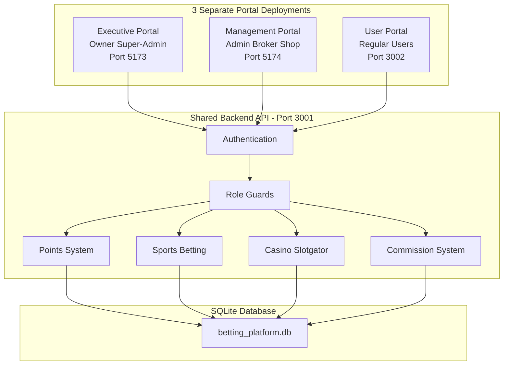
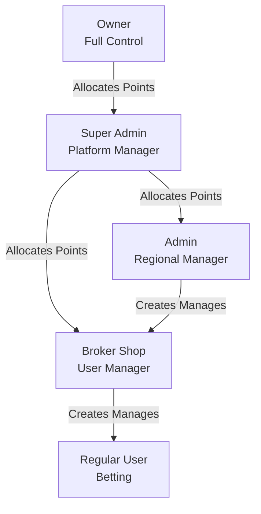

# Multi-Portal Betting Platform - Complete Implementation Plan

## Current State

- **Backend**: Node.js/Express API at [server/](server/) using PostgreSQL
- **Admin Dashboard**: React/Vite app at [src/](src/) for super_admin and broker roles
- **User Portal**: Next.js app at [nadir-user/](nadir-user/) for regular users
- **Database**: PostgreSQL with user roles: `super_admin`, `broker`, `regular_user`
- **Casino API**: Slotgator - NOT implemented yet (will be implemented in Phase 5)
- **Sports API**: Placeholder files exist but NOT implemented (will be implemented in Phase 6)

## Target Architecture

### 3 Separate Portal Deployments



### User Hierarchy & Points Flow



---

## Phase 0: Code Cleanup & Organization

**Goal**: Clean codebase before implementing new features.

### Actions

**Remove Unused Files:**

- Clean up [assets/](assets/) - remove temporary images
- Remove old documentation that's no longer relevant
- Delete temporary test files

**Fix Linting Errors:**

- Run ESLint on all [src/](src/) components
- Run ESLint on [nadir-user/](nadir-user/) components
- Fix [server/src/](server/src/) code quality issues
- Remove unused imports and console.log statements

**Update Dependencies:**

- Run `npm audit fix` on all package.json files
- Update to latest compatible versions
- Remove unused dependencies

**Organize Code:**

- Add JSDoc comments to complex functions in [server/src/](server/src/)
- Standardize error handling patterns
- Consolidate duplicate utility functions

**Clean Environment Files:**

- Update [env.example](env.example) with all required variables
- Remove sensitive data from examples
- Document each environment variable

### Testing Phase 0

- [ ] No linting errors in any portal
- [ ] No security vulnerabilities
- [ ] Application runs correctly
- [ ] All existing features work

---

## Phase 1: Portal Structure & Separation

**Goal**: Create 3 separate portal deployments with shared UI design.

### 1.1 Create Directory Structure

**New folders:**

```
nadir/
├── admin-portal-executive/     # Owner + Super Admin
├── admin-portal-management/    # Admin + Broker + Shop  
├── nadir-user/                 # Regular Users (existing)
└── server/                     # Shared backend
```

### 1.2 Executive Portal Setup

**Create [admin-portal-executive/](admin-portal-executive/)**

Copy from [src/](src/):

- All components, contexts, hooks, services
- package.json, vite.config.ts, tsconfig.json
- index.html, tailwind.config.js, postcss.config.js

**Update package.json:**

```json
{
  "name": "admin-portal-executive"
}
```

**Create .env.example:**

```
VITE_API_URL=http://localhost:3001/api
VITE_PORTAL_TYPE=executive
VITE_ALLOWED_ROLES=owner,super_admin
```

**Modify [admin-portal-executive/src/contexts/AuthContext.tsx](admin-portal-executive/src/contexts/AuthContext.tsx):**

- Add role validation: only allow owner/super_admin
- Redirect other roles to appropriate portal

### 1.3 Management Portal Setup

**Create [admin-portal-management/](admin-portal-management/)**

Same structure as executive portal but:

- `"name": "admin-portal-management"`
- `VITE_ALLOWED_ROLES=admin,broker`
- Restrict to admin/broker roles
- Hide owner/super-admin features

### 1.4 User Portal Protection

**Create [nadir-user/middleware.ts](nadir-user/middleware.ts):**

```typescript
import { NextResponse } from 'next/server';

export function middleware(request: NextRequest) {
  // Verify user is regular_user only
  // Redirect admins to their portal
}
```

### 1.5 Docker Configuration

**Update [docker-compose.yml](docker-compose.yml):**

```yaml
services:
  backend:
    # Existing
    
  admin-executive:
    build: ./admin-portal-executive
    ports:
      - "5173:5173"
    environment:
      - VITE_API_URL=http://backend:3001/api
      
  admin-management:
    build: ./admin-portal-management
    ports:
      - "5174:5173"
      
  user-portal:
    build: ./nadir-user
    ports:
      - "3002:3000"
```

**Create Dockerfiles:**

- [admin-portal-executive/Dockerfile](admin-portal-executive/Dockerfile)
- [admin-portal-management/Dockerfile](admin-portal-management/Dockerfile)

### 1.6 Backend Updates

**Update [server/src/index.js](server/src/index.js) CORS:**

```javascript
app.use(cors({
  origin: [
    'http://localhost:5173',  // Executive
    'http://localhost:5174',  // Management
    'http://localhost:3002'   // User
  ],
  credentials: true
}));
```

**Update [server/src/routes/auth.js](server/src/routes/auth.js):**

```javascript
// Return portal URL based on role
res.json({
  user, token,
  redirectTo: getPortalUrl(user.role)
});
```

### Testing Phase 1

- [ ] Executive portal runs on port 5173
- [ ] Management portal runs on port 5174
- [ ] User portal runs on port 3002
- [ ] All 3 connect to backend
- [ ] Owner/Super Admin only access executive
- [ ] Admin/Broker only access management
- [ ] Regular user only accesses user portal
- [ ] Cross-portal redirects work
- [ ] All portals have same UI design

---

## Phase 2: SQLite Database Migration

**Goal**: Replace PostgreSQL with SQLite.

### 2.1 Schema Conversion

**Create [server/src/database/sqlite-schema.sql](server/src/database/sqlite-schema.sql)**

Convert from [database/init/](database/init/):

- `UUID` → `TEXT` with app-level generation
- `TIMESTAMP WITH TIME ZONE` → `TEXT` (ISO 8601)
- `JSONB` → `TEXT` (JSON strings)
- `DECIMAL` → `REAL`
- `BIGINT` → `INTEGER`
- ENUMs → CHECK constraints
- Triggers/functions → application logic

### 2.2 Database Connection Layer

**Create [server/src/database/db.js](server/src/database/db.js)**

```javascript
import Database from 'better-sqlite3';
import { v4 as uuidv4 } from 'uuid';

class DatabaseWrapper {
  constructor() {
    this.db = new Database('./data/betting_platform.db');
  }
  
  // Async-compatible query interface
  async query(sql, params = []) {
    // Wrap sync sqlite3 in promise
  }
  
  transaction(callback) {
    // Transaction support
  }
}

export const db = new DatabaseWrapper();
```

### 2.3 Update Dependencies

**In [server/package.json](server/package.json):**

Remove: `pg`

Add: `better-sqlite3`, `uuid`

### 2.4 Update All Query Files

**Files to update:**

- [server/src/routes/auth.js](server/src/routes/auth.js)
- [server/src/routes/users.js](server/src/routes/users.js)
- [server/src/routes/brokers.js](server/src/routes/brokers.js)
- [server/src/routes/transactions.js](server/src/routes/transactions.js)
- [server/src/routes/dashboard.js](server/src/routes/dashboard.js)
- [server/src/routes/cashout.js](server/src/routes/cashout.js)

Replace all `pool.query()` calls with `db.query()`.

**Note**: Casino API (Slotgator) will be implemented in Phase 5, so no casino routes exist yet to migrate.

### 2.5 Update Docker

**Update [docker-compose.yml](docker-compose.yml):**

- Remove postgres and pgadmin services
- Add volume mount for SQLite: `./server/data:/app/data`

**Update [Dockerfile.backend](Dockerfile.backend):**

- Remove PostgreSQL client dependencies

### Testing Phase 2

- [ ] Database schema created
- [ ] All tables and indexes present
- [ ] Authentication works
- [ ] CRUD operations work
- [ ] All 3 portals display data
- [ ] Database persists across restarts

**Note**: Casino integration will be tested in Phase 5.

---

## Phase 3: Role System & Access Control

**Goal**: Implement 5-tier role system.

### 3.1 Database Schema

**Create [server/src/database/migrations/003-add-roles.sql](server/src/database/migrations/003-add-roles.sql)**

```sql
ALTER TABLE users ADD COLUMN parent_id TEXT REFERENCES users(user_id);
ALTER TABLE users ADD COLUMN created_by TEXT REFERENCES users(user_id);
-- Update user_type check to include: owner, super_admin, admin, broker, regular_user
```

### 3.2 Backend Middleware

**Update [server/src/middleware/auth.js](server/src/middleware/auth.js)**

```javascript
export const requireRole = (allowedRoles) => {
  return (req, res, next) => {
    if (!allowedRoles.includes(req.user.role)) {
      return res.status(403).json({ error: 'Insufficient permissions' });
    }
    next();
  };
};

export const requireMinimumRole = (minimumRole) => {
  // Check role hierarchy
};

export const canManageUser = (managerId, targetUserId) => {
  // Verify hierarchy relationship
};
```

### 3.3 Executive Portal Updates

**In [admin-portal-executive/src/](admin-portal-executive/src/)**

- Show all features for owner/super_admin
- Add owner-specific dashboard
- Add super admin management UI

### 3.4 Management Portal Updates

**In [admin-portal-management/src/](admin-portal-management/src/)**

- Hide owner/super-admin features
- Show broker/shop creation
- Show user management

### 3.5 Backend Route Protection

**Update routes:**

```javascript
// Only owner can create super_admin
router.post('/super-admin', 
  authenticateToken, 
  requireRole(['owner']), 
  createSuperAdmin
);

// Super admin can create admins/brokers
router.post('/admin', 
  authenticateToken, 
  requireRole(['super_admin']), 
  createAdmin
);

// Admin can create brokers
router.post('/broker', 
  authenticateToken, 
  requireRole(['super_admin', 'admin']), 
  createBroker
);

// Brokers create users
router.post('/user', 
  authenticateToken, 
  requireRole(['broker']), 
  createUser
);
```

### Testing Phase 3

- [ ] Owner can create super admins
- [ ] Super admin can create admins/brokers
- [ ] Admin can create brokers
- [ ] Broker can create users
- [ ] Role hierarchy enforced
- [ ] Unauthorized access blocked
- [ ] Each portal shows correct features

---

## Phase 4: Points Hierarchy System

**Goal**: Implement points allocation flow.

### 4.1 Database Tables

**Create [server/src/database/migrations/004-points-system.sql](server/src/database/migrations/004-points-system.sql)**

```sql
CREATE TABLE points_allocation (
    allocation_id TEXT PRIMARY KEY,
    from_user_id TEXT NOT NULL,
    to_user_id TEXT NOT NULL,
    points_allocated INTEGER NOT NULL,
    points_remaining INTEGER NOT NULL,
    allocation_date TEXT NOT NULL,
    status TEXT CHECK(status IN ('active', 'expired', 'revoked'))
);

CREATE TABLE points_ledger (
    ledger_id TEXT PRIMARY KEY,
    user_id TEXT NOT NULL,
    transaction_type TEXT,
    points_change INTEGER NOT NULL,
    balance_after INTEGER NOT NULL,
    created_at TEXT NOT NULL
);
```

### 4.2 Points Service

**Create [server/src/services/PointsService.js](server/src/services/PointsService.js)**

```javascript
class PointsService {
  async allocatePoints(fromUserId, toUserId, amount) {
    // Validate hierarchy
    // Check sufficient points
    // Atomic transaction
  }
  
  async getUserAvailablePoints(userId) { }
  async deductPoints(userId, amount, reason) { }
  async getPointsHistory(userId) { }
}
```

### 4.3 API Routes

**Create [server/src/routes/points.js](server/src/routes/points.js)**

```javascript
POST /api/points/allocate
GET /api/points/balance
GET /api/points/history
POST /api/points/revoke
```

### 4.4 Frontend Components

**For both admin portals, create:**

- Points allocation modal
- Points balance display
- Points history table
- Visual hierarchy tree

### Testing Phase 4

- [ ] Owner allocates to super admin
- [ ] Super admin distributes to admins/brokers
- [ ] Admin allocates to brokers
- [ ] Broker allocates to users (deposits)
- [ ] Cannot exceed available points
- [ ] Complete audit trail
- [ ] Balance calculations correct

---

## Phase 5: Slotgator Casino API Integration

**Goal**: Integrate Slotgator casino API for slot games and casino betting.

### 5.1 Slotgator API Setup

**Research & Documentation:**

- Review Slotgator API documentation
- Obtain API credentials (API key, operator ID, etc.)
- Understand authentication flow
- Review game launch process
- Understand webhook/callback system

**Add to [server/env](server/env):**

```
SLOTGATOR_API_URL=https://api.slotgator.com
SLOTGATOR_API_KEY=your_api_key_here
SLOTGATOR_OPERATOR_ID=your_operator_id
SLOTGATOR_SECRET_KEY=your_secret_key
SLOTGATOR_CALLBACK_URL=https://yourdomain.com/api/slotgator/callback
```

### 5.2 Slotgator Service Layer

**Create [server/src/services/SlotgatorApiService.js](server/src/services/SlotgatorApiService.js)**

```javascript
class SlotgatorApiService {
  constructor() {
    this.apiUrl = process.env.SLOTGATOR_API_URL;
    this.apiKey = process.env.SLOTGATOR_API_KEY;
    this.operatorId = process.env.SLOTGATOR_OPERATOR_ID;
    this.secretKey = process.env.SLOTGATOR_SECRET_KEY;
  }
  
  async getAvailableGames() {
    // Fetch list of available casino games
  }
  
  async getGameCategories() {
    // Get game categories (slots, table games, etc.)
  }
  
  async generateGameUrl(userId, gameId, options) {
    // Generate authenticated game launch URL
  }
  
  async authenticatePlayer(playerId) {
    // Handle player authentication for game session
  }
  
  async getPlayerBalance(playerId) {
    // Get player's current balance
  }
  
  validateWebhook(data, signature) {
    // Validate incoming webhooks from Slotgator
  }
}

export default new SlotgatorApiService();
```

### 5.3 Casino Database Tables

**Create [server/src/database/migrations/005-casino-slotgator.sql](server/src/database/migrations/005-casino-slotgator.sql)**

```sql
-- Casino game sessions
CREATE TABLE casino_sessions (
    session_id TEXT PRIMARY KEY,
    user_id TEXT NOT NULL REFERENCES users(user_id),
    game_id TEXT NOT NULL,
    game_name TEXT,
    token TEXT UNIQUE NOT NULL,
    status TEXT DEFAULT 'active' CHECK(status IN ('active', 'completed', 'expired')),
    started_at TEXT NOT NULL,
    ended_at TEXT,
    total_bet INTEGER DEFAULT 0,
    total_win INTEGER DEFAULT 0
);

-- Casino transactions (bets, wins, refunds)
CREATE TABLE casino_transactions (
    transaction_id TEXT PRIMARY KEY,
    user_id TEXT NOT NULL REFERENCES users(user_id),
    session_id TEXT REFERENCES casino_sessions(session_id),
    transaction_type TEXT CHECK(transaction_type IN ('bet', 'win', 'refund', 'bonus', 'jackpot')),
    game_id TEXT NOT NULL,
    reference TEXT UNIQUE NOT NULL,
    round_id TEXT,
    amount INTEGER NOT NULL,
    balance_before INTEGER NOT NULL,
    balance_after INTEGER NOT NULL,
    created_at TEXT NOT NULL,
    metadata TEXT  -- JSON for additional data
);

-- Casino games catalog
CREATE TABLE casino_games (
    game_id TEXT PRIMARY KEY,
    game_name TEXT NOT NULL,
    provider TEXT DEFAULT 'slotgator',
    category TEXT,  -- slots, table_games, live_casino, etc.
    thumbnail_url TEXT,
    is_active INTEGER DEFAULT 1,
    min_bet INTEGER,
    max_bet INTEGER,
    created_at TEXT NOT NULL,
    updated_at TEXT NOT NULL
);

-- Indexes for performance
CREATE INDEX idx_casino_sessions_user ON casino_sessions(user_id);
CREATE INDEX idx_casino_sessions_status ON casino_sessions(status);
CREATE INDEX idx_casino_transactions_user ON casino_transactions(user_id);
CREATE INDEX idx_casino_transactions_session ON casino_transactions(session_id);
CREATE INDEX idx_casino_transactions_reference ON casino_transactions(reference);
CREATE INDEX idx_casino_games_category ON casino_games(category);
CREATE INDEX idx_casino_games_active ON casino_games(is_active);
```

### 5.4 Casino API Routes

**Create [server/src/routes/casino.js](server/src/routes/casino.js)**

```javascript
import express from 'express';
import slotgatorApiService from '../services/SlotgatorApiService.js';
import { authenticateToken } from '../middleware/auth.js';

const router = express.Router();

// Get available casino games
GET /api/casino/games
router.get('/games', authenticateToken, async (req, res) => {
  const { category } = req.query;
  // Fetch games from DB or Slotgator API
});

// Get game categories
GET /api/casino/categories
router.get('/categories', authenticateToken, async (req, res) => {
  // Return available categories
});

// Launch casino game
POST /api/casino/launch
router.post('/launch', authenticateToken, async (req, res) => {
  const { gameId } = req.body;
  const userId = req.user.id;
  
  // 1. Create session
  // 2. Generate game URL from Slotgator
  // 3. Return game URL to frontend
});

// Get user's casino history
GET /api/casino/history
router.get('/history', authenticateToken, async (req, res) => {
  // Return user's casino sessions and transactions
});

// Webhook endpoints (NO authentication - Slotgator calls these)
POST /api/casino/webhook/authenticate
router.post('/webhook/authenticate', async (req, res) => {
  // Authenticate player session
});

POST /api/casino/webhook/balance
router.post('/webhook/balance', async (req, res) => {
  // Return player balance
});

POST /api/casino/webhook/bet
router.post('/webhook/bet', async (req, res) => {
  // Process bet placement
  // Deduct points from user
});

POST /api/casino/webhook/win
router.post('/webhook/win', async (req, res) => {
  // Process win
  // Credit points to user
});

POST /api/casino/webhook/refund
router.post('/webhook/refund', async (req, res) => {
  // Process refund
});

export default router;
```

**Register routes in [server/src/index.js](server/src/index.js)**:

```javascript
import casinoRoutes from './routes/casino.js';
app.use('/api/casino', casinoRoutes);
```

### 5.5 Casino Betting Service

**Create [server/src/services/CasinoBettingService.js](server/src/services/CasinoBettingService.js)**

```javascript
class CasinoBettingService {
  async createSession(userId, gameId) {
    // Create casino session
    // Generate unique token
    // Return session details
  }
  
  async processBet(userId, amount, gameId, roundId, reference) {
    // Validate user has sufficient points
    // Check for duplicate transaction (reference)
    // Deduct points atomically
    // Create transaction record
    // Return updated balance
  }
  
  async processWin(userId, amount, gameId, roundId, reference) {
    // Credit winning amount
    // Create transaction record
    // Trigger commission calculation
    // Return updated balance
  }
  
  async processRefund(reference) {
    // Find original transaction
    // Refund points to user
    // Create refund transaction
  }
  
  async getCasinoHistory(userId, limit = 50) {
    // Get user's casino sessions and transactions
  }
}

export default new CasinoBettingService();
```

### 5.6 User Portal Casino UI

**Update [nadir-user/](nadir-user/)**

**Update [nadir-user/app/casino/page.tsx](nadir-user/app/casino/page.tsx)**:

- Connect to real casino API endpoints
- Display games from database
- Implement game launch modal
- Add game filters (category, provider, search)

**Update [nadir-user/components/casino/GameCard.tsx](nadir-user/components/casino/GameCard.tsx)**:

- Display real game data
- Handle game launch onClick
- Show game details

**Create [nadir-user/components/casino/GameLauncher.tsx](nadir-user/components/casino/GameLauncher.tsx)**:

- Modal/fullscreen game launcher
- iframe for game embedding
- Handle game exit/close
- Show balance during gameplay

**Create [nadir-user/lib/casinoApi.ts](nadir-user/lib/casinoApi.ts)**:

```typescript
export const casinoApi = {
  async getGames(category?: string) {
    // GET /api/casino/games
  },
  
  async launchGame(gameId: string) {
    // POST /api/casino/launch
  },
  
  async getCasinoHistory() {
    // GET /api/casino/history
  }
};
```

### 5.7 Admin Portal Casino Management

**For Executive Portal:**

- Casino games management (enable/disable games)
- Casino revenue reports
- Casino transaction monitoring
- Popular games analytics

**For Management Portal:**

- Broker can see users' casino activity
- Casino-related cashout requests
- User casino statistics

**Create components:**

- `CasinoGamesManager.tsx` - Manage game catalog
- `CasinoReports.tsx` - Casino revenue and activity
- `CasinoTransactions.tsx` - Transaction monitoring

### 5.8 Commission Integration

**Update [server/src/services/CommissionService.js](server/src/services/CommissionService.js)**:

Add casino commission calculation:

```javascript
async function distributeCasinoCommission(transaction, result) {
  // Similar to sports betting commission
  // Distribute based on casino-specific rules
  // May have different commission rates for casino vs sports
}
```

### 5.9 Testing Checklist (Phase 5)

- [ ] Slotgator API credentials configured
- [ ] Games list loads from Slotgator
- [ ] Game categories display correctly
- [ ] User can launch casino game
- [ ] Game loads in iframe/modal
- [ ] Authentication webhook works
- [ ] Balance webhook returns correct balance
- [ ] Bet webhook deducts points correctly
- [ ] Win webhook credits points correctly
- [ ] No duplicate transactions (reference check)
- [ ] Casino history displays correctly
- [ ] Commission distributed on casino bets
- [ ] Admin can see casino transactions
- [ ] Casino games can be enabled/disabled
- [ ] Refunds work correctly
- [ ] Session management works
- [ ] User balance updates in real-time

---

## Phase 6: Sports API Integration

**Goal**: Implement live sports betting.

### 6.1 API Selection & Setup

**Recommended**: The Odds API (https://the-odds-api.com)

**Add to [server/env](server/env):**

```
SPORTS_API_URL=https://api.the-odds-api.com
SPORTS_API_KEY=your_key_here
```

### 6.2 Sports Service

**Create [server/src/services/SportsApiService.js](server/src/services/SportsApiService.js)**

```javascript
class SportsApiService {
  async getSports() { }
  async getUpcomingMatches(sport) { }
  async getLiveMatches(sport) { }
  async getMatchOdds(matchId) { }
  async getCachedOdds(matchId) { }
}
```

### 5.3 Database Tables

**Create [server/src/database/migrations/006-sports-betting.sql](server/src/database/migrations/006-sports-betting.sql)**

```sql
CREATE TABLE sports_matches (
    match_id TEXT PRIMARY KEY,
    sport_key TEXT NOT NULL,
    home_team TEXT NOT NULL,
    away_team TEXT NOT NULL,
    commence_time TEXT NOT NULL,
    status TEXT DEFAULT 'upcoming'
);

CREATE TABLE sports_odds (
    odds_id TEXT PRIMARY KEY,
    match_id TEXT NOT NULL,
    market_type TEXT NOT NULL,
    outcome_name TEXT NOT NULL,
    odds_decimal REAL NOT NULL
);

CREATE TABLE sports_bets (
    bet_id TEXT PRIMARY KEY,
    user_id TEXT NOT NULL,
    match_id TEXT NOT NULL,
    bet_type TEXT NOT NULL,
    selections TEXT NOT NULL,
    total_odds REAL NOT NULL,
    stake INTEGER NOT NULL,
    potential_win INTEGER NOT NULL,
    status TEXT DEFAULT 'pending'
);
```

### 6.4 Betting Routes

**Create [server/src/routes/sports.js](server/src/routes/sports.js)**

```javascript
GET /api/sports
GET /api/sports/:sportKey/matches
POST /api/sports/bet
GET /api/sports/bets
```

### 5.5 Betting Service

**Create [server/src/services/BettingService.js](server/src/services/BettingService.js)**

```javascript
async function placeSportsBet(userId, betData) {
  // Validate points
  // Validate odds
  // Deduct points
  // Create bet record
  // Create transaction
}
```

### 5.6 Odds Caching

**Create [server/src/jobs/oddsUpdater.js](server/src/jobs/oddsUpdater.js)**

```javascript
import cron from 'node-cron';

cron.schedule('*/5 * * * *', async () => {
  await updateUpcomingMatches();
  await updateLiveMatchOdds();
});
```

### 5.7 Match Settlement

**Create [server/src/services/SettlementService.js](server/src/services/SettlementService.js)**

```javascript
async function settleMatch(matchId, results) {
  // Get pending bets
  // Determine winners
  // Credit winnings
  // Update bet status
  // Trigger commission (Phase 6)
}
```

### 6.8 User Portal Updates

**Update [nadir-user/](nadir-user/)**

- Connect [nadir-user/lib/sportsbookApi.ts](nadir-user/lib/sportsbookApi.ts) to real API
- Update components to show live odds
- Add bet slip functionality
- Add betting history

### Testing Phase 6

- [ ] Sports list loads from API
- [ ] Matches display with odds
- [ ] Odds update every 5 minutes
- [ ] Users can place bets
- [ ] Points deducted correctly
- [ ] Bets appear in history
- [ ] Settlement awards winnings
- [ ] Parlay bets work

---

## Phase 7: Commission & Cashback System

**Goal**: Flexible revenue distribution.

### 6.1 Database Tables

**Create [server/src/database/migrations/006-commission-system.sql](server/src/database/migrations/006-commission-system.sql)**

```sql
CREATE TABLE commission_config (
    config_id TEXT PRIMARY KEY,
    config_name TEXT UNIQUE NOT NULL,
    rules TEXT NOT NULL,  -- JSON
    is_active INTEGER DEFAULT 1
);

CREATE TABLE commission_ledger (
    commission_id TEXT PRIMARY KEY,
    bet_id TEXT,
    user_id TEXT NOT NULL,
    broker_id TEXT,
    admin_id TEXT,
    super_admin_id TEXT,
    bet_amount INTEGER NOT NULL,
    bet_result TEXT,
    broker_commission INTEGER DEFAULT 0,
    admin_commission INTEGER DEFAULT 0,
    super_admin_commission INTEGER DEFAULT 0,
    platform_revenue INTEGER DEFAULT 0,
    cashback_to_user INTEGER DEFAULT 0,
    config_used TEXT NOT NULL
);
```

### 7.2 Commission Config Example

```json
{
  "on_loss": {
    "broker_commission_percent": 10,
    "admin_commission_percent": 5,
    "super_admin_commission_percent": 3,
    "platform_revenue_percent": 82
  },
  "on_win": {
    "broker_commission_percent": 2,
    "admin_commission_percent": 1,
    "super_admin_commission_percent": 0.5,
    "platform_deduction_percent": 96.5
  },
  "cashback_rules": {
    "monthly_loss_threshold": 100000,
    "cashback_percent": 5
  }
}
```

### 7.3 Commission Service

**Create [server/src/services/CommissionService.js](server/src/services/CommissionService.js)**

```javascript
class CommissionService {
  async distributeCommission(bet, result) {
    // Get config
    // Get user hierarchy
    // Calculate shares
    // Update balances
    // Create ledger entry
  }
}
```

### 6.4 Cashback Service

**Create [server/src/services/CashbackService.js](server/src/services/CashbackService.js)**

```javascript
async function calculateMonthlyCashback(userId) {
  // Get monthly losses
  // Check threshold
  // Calculate cashback
  // Credit user
}

// Monthly cron job
cron.schedule('0 0 1 * *', async () => {
  await processAllUserCashback();
});
```

### 7.5 Cashout System

**Update [server/src/routes/cashout.js](server/src/routes/cashout.js)**

```javascript
POST /api/cashout/request
POST /api/cashout/:id/approve (Broker only)
POST /api/cashout/:id/reject (Broker only)
```

### 7.6 Admin UI Components

**For executive portal:**

- Commission config management
- Commission reports
- Platform revenue dashboard

**For management portal:**

- Commission earnings view
- Cashout approval queue
- User cashback status

### 6.7 Integration with Settlement

**Update [server/src/services/SettlementService.js](server/src/services/SettlementService.js)**

```javascript
async function settleMatch(matchId, results) {
  const bets = await getPendingBets(matchId);
  
  for (const bet of bets) {
    const result = determineBetResult(bet, results);
    
    if (result === 'won') {
      await addWinnings(bet);
    }
    
    // Distribute commission
    await CommissionService.distributeCommission(bet, result);
    
    await updateBetStatus(bet.bet_id, result);
  }
}
```

### Testing Phase 6

- [ ] Commission config created
- [ ] Lost bet distributes correctly
- [ ] Won bet distributes correctly
- [ ] All hierarchy members receive shares
- [ ] Cashback calculates correctly
- [ ] Cashout requests work
- [ ] Broker approvals work
- [ ] Commission reports accurate

---

## Phase 8: Production Testing & Deployment

**Goal**: Comprehensive testing and deployment.

### 7.1 End-to-End Scenarios

**Scenario 1: Complete User Lifecycle**

1. Owner creates super admin with 1M points
2. Super admin creates admin with 200K points
3. Admin creates broker with 50K points
4. Broker creates regular user
5. User deposits $100 (10K points)
6. User places sports bet (5K points)
7. Bet settles
8. Commission distributed
9. User requests cashout
10. Broker approves
11. Verify all balances

**Scenario 2: Points Flow**

- Test allocation cascading
- Verify insufficient points blocks
- Test points revocation
- Audit trail completeness

**Scenario 3: Sports Betting**

- Fetch live odds
- Place single/parlay bets
- Simulate settlement
- Verify winnings
- Verify commission

**Scenario 4: Access Control**

- Test unauthorized access (should fail)
- Verify portal restrictions
- Test hierarchy violations

### 8.2 Performance Testing

Use autocannon or artillery:

- 100 concurrent users
- 50 simultaneous bets
- Database performance < 100ms
- SQLite file size monitoring

### 8.3 Database Backup

**Create [server/src/jobs/backup.js](server/src/jobs/backup.js)**

```javascript
cron.schedule('0 2 * * *', async () => {
  const timestamp = new Date().toISOString();
  const backupPath = `./backups/db_${timestamp}.db`;
  await copyFile('./data/betting_platform.db', backupPath);
  await cleanOldBackups(30);
});
```

### 7.4 Production Docker

**Update [docker-compose.prod.yml](docker-compose.prod.yml)**

```yaml
version: '3.8'
services:
  backend:
    volumes:
      - ./server/data:/app/data
      - ./server/backups:/app/backups
    environment:
      NODE_ENV: production
      
  admin-executive:
    environment:
      NODE_ENV: production
      
  admin-management:
    environment:
      NODE_ENV: production
      
  user-portal:
    environment:
      NODE_ENV: production
```

### 8.5 Security Checklist

- [ ] Passwords hashed with bcrypt
- [ ] JWT tokens expire appropriately
- [ ] Rate limiting enabled
- [ ] Input validation on all endpoints
- [ ] Parameterized queries (SQL injection prevention)
- [ ] CORS configured correctly
- [ ] Environment variables secured
- [ ] SQLite file permissions correct
- [ ] Authentication on all protected routes
- [ ] Role hierarchy enforced

### 8.6 Deployment Steps

1. Build images: `docker-compose -f docker-compose.prod.yml build`
2. Initialize database: `npm run migrate:prod`
3. Create owner account: `npm run create:owner`
4. Start services: `docker-compose -f docker-compose.prod.yml up -d`
5. Verify health: `curl http://server/health`
6. Smoke testing

### 7.7 Documentation

Create/update:

- [README.md](README.md) - Project overview
- [API_DOCUMENTATION.md](API_DOCUMENTATION.md) - All endpoints
- [USER_GUIDE.md](USER_GUIDE.md) - User instructions
- [ADMIN_GUIDE.md](ADMIN_GUIDE.md) - Admin operations
- [DEPLOYMENT.md](DEPLOYMENT.md) - Deployment guide

### Final Testing Checklist

**Database & Backend:**

- [ ] SQLite initializes correctly
- [ ] Migrations run successfully
- [ ] Backups work
- [ ] All endpoints respond
- [ ] Authentication works
- [ ] RBAC enforced

**Points System:**

- [ ] Allocation works all levels
- [ ] Cannot exceed available
- [ ] Balances accurate
- [ ] Audit trail complete

**Sports Betting:**

- [ ] Odds update from API
- [ ] Bets placed successfully
- [ ] Settlement works
- [ ] Parlay calculations correct

**Casino (Slotgator):**

- [ ] Slotgator API integration complete
- [ ] Games list loads from Slotgator
- [ ] Games launch correctly
- [ ] Casino sessions created
- [ ] Bet transactions recorded
- [ ] Win transactions credited
- [ ] Webhooks work correctly
- [ ] Balance updates in real-time

**Commission:**

- [ ] Config management works
- [ ] Distribution correct (win/loss)
- [ ] All shares correct
- [ ] Cashback calculates

**Cashout:**

- [ ] Requests created
- [ ] Approvals work
- [ ] Points deducted
- [ ] Queue displays

**Portals:**

- [ ] Executive: Owner/Super Admin access only
- [ ] Management: Admin/Broker access only
- [ ] User: Regular user access only
- [ ] All KPIs display correctly
- [ ] Reports generate properly

**Production:**

- [ ] All containers start
- [ ] Services communicate
- [ ] HTTPS/SSL configured
- [ ] Backups running
- [ ] Logs written
- [ ] Performance acceptable

---

## Success Criteria

Project complete when:

1. ✅ 3 separate portals deployed with shared UI
2. ✅ SQLite migration complete and stable
3. ✅ 5 user roles with proper access control
4. ✅ Points flow correctly through hierarchy
5. ✅ Slotgator casino API integrated and functional
6. ✅ Sports betting works with live odds
7. ✅ Commission distributes correctly
8. ✅ Cashout system operational
9. ✅ All tests passing
10. ✅ Documentation complete

## Risk Mitigation

**High-Risk Areas:**

1. **SQLite Migration** - Test extensively, keep PostgreSQL as backup
2. **Points Hierarchy** - Atomic transactions, extensive logging
3. **Sports API Limits** - Aggressive caching, graceful degradation
4. **Commission Logic** - Dry-run mode, manual verification

**Rollback Strategy:**

- Keep PostgreSQL docker-compose as backup
- Version control all schema changes
- Database export scripts ready
- Test rollback before production