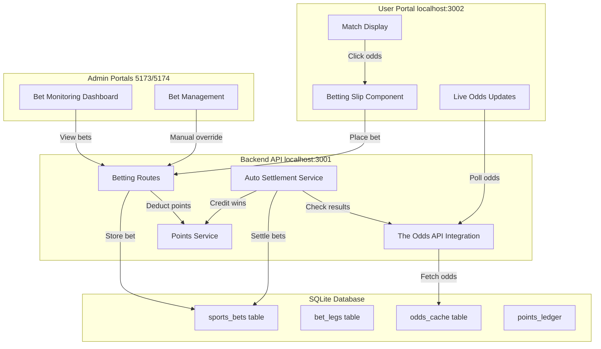

# Sports Betting Implementation Plan

## Architecture Overview



---

## Phase 1: Database Schema Enhancement

### New Tables Required

**1. `sports_bets` table** (enhanced from existing `bets`)

- Primary bet information
- Fields: `bet_id`, `user_id`, `broker_id`, `bet_type` ('single', 'accumulator', 'system'), `total_stake`, `potential_payout`, `status` ('pending', 'won', 'lost', 'void', 'partially_won'), `bet_placed_at`, `settled_at`
- Links: `transaction_id` (FK to transactions), points tracking

**2. `bet_legs` table** (NEW)

- Individual selections within a bet
- Fields: `leg_id`, `bet_id` (FK), `sport`, `league`, `match_id`, `market_type` ('match_winner', 'total_goals', 'handicap'), `selection` ('home', 'away', 'over', 'under'), `odds_when_placed`, `status` ('pending', 'won', 'lost', 'void'), `match_start_time`, `result_fetched_at`
- External identifiers: `external_match_id`, `bookmaker_key`

**3. `odds_cache` table** (NEW)

- Cache for The Odds API data
- Fields: `cache_id`, `sport`, `league`, `match_id`, `external_match_id`, `market_type`, `odds_data` (JSON), `bookmaker_key`, `cached_at`, `expires_at`
- Reduces API calls, enables faster loading

**4. `system_bet_combinations` table** (NEW)

- Track combinations in system bets (e.g., 3/5, 4/7)
- Fields: `combination_id`, `bet_id` (FK), `combination_legs` (JSON array of leg_ids), `stake`, `potential_win`, `status`

### Schema Migration Files

Create in [`database/init/`](database/init/):

- `10-create-sports-betting-tables.sql` - New tables
- `11-create-sports-betting-indexes.sql` - Performance indexes
- `12-insert-bet-configurations.sql` - Bet limits, market types

---

## Phase 2: The Odds API Integration

### Backend Service Layer

**1. Create `OddsAPIService.js`** in [`server/src/services/`](server/src/services/)

Core methods:

```javascript
class OddsAPIService {
  async getSports() // List available sports
  async getOddsForSport(sport, region='eu', markets='h2h,totals') // Fetch live odds
  async getMatchDetails(sport, eventId) // Specific match odds
  async getScores(sport, daysFrom=1) // Completed match results
  async getLiveOdds(sport) // In-play odds (for live betting)
  
  // Caching layer
  async getCachedOdds(sport, matchId) // Check cache first
  async refreshOddsCache(sport) // Background refresh
}
```

**Configuration** in [`server/env`](server/env):

```env
ODDS_API_KEY=your_api_key_here
ODDS_API_BASE_URL=https://api.the-odds-api.com/v4
ODDS_API_REGION=eu
ODDS_DEFAULT_BOOKMAKER=bet365
ODDS_CACHE_TTL_SECONDS=300
```

**2. Extend `PointsService.js`** ([`server/src/services/PointsService.js`](server/src/services/PointsService.js))

Add missing method:

```javascript
async addPoints(userId, amount, reason, relatedTransactionId = null) {
  // Credit points for bet wins
  // Create ledger entry with type 'bet_won'
  // Update current_balance atomically
  // Return new balance
}
```

**3. Create `BettingService.js`** in [`server/src/services/`](server/src/services/)

Business logic:

```javascript
class BettingService {
  async placeBet(userId, betData) {
    // Validate bet structure
    // Check odds still valid (compare with live odds)
    // Calculate potential payout
    // Deduct points via PointsService.deductPoints()
    // Create bet record and legs in transaction
    // Return bet_id
  }
  
  async validateBet(betData) {
    // Check minimum/maximum stakes
    // Verify match hasn't started (unless live betting enabled)
    // Validate odds haven't changed significantly (>5% drift alert)
  }
  
  async getUserBets(userId, filters) // Fetch user bet history
  async getBetDetails(betId) // Full bet with legs
  async settleBet(betId) // Manual settlement override (admin)
}
```

**4. Create `SettlementService.js`** in [`server/src/services/`](server/src/services/)

Automatic settlement:

```javascript
class SettlementService {
  async checkPendingBets() {
    // Find bets with matches that ended >15min ago
    // Fetch results from OddsAPI.getScores()
    // Determine win/loss for each leg
    // Calculate payout for accumulator/system bets
    // Call settleBet() for each
  }
  
  async settleBet(betId, results) {
    // Update bet_legs status
    // Calculate final payout (handle void legs)
    // Update sports_bets status and payout
    // Credit points via PointsService.addPoints() if won
    // Create ledger entry
  }
  
  async startSettlementWorker() {
    // Cron job running every 5 minutes
    // Processes pending bets automatically
  }
}
```

---

## Phase 3: Backend API Routes

### Create `server/src/routes/betting.js`

**Odds endpoints:**

```javascript
GET /api/betting/sports
 - List available sports from The Odds API
 - Response: [{ key: 'soccer_epl', title: 'EPL', ... }]

GET /api/betting/odds/:sport
 - Get live odds for a sport
 - Query params: region, markets, live (boolean)
 - Response: Array of matches with odds

GET /api/betting/match/:sport/:eventId
 - Detailed odds for specific match
 - Includes all markets (h2h, totals, spreads)
```

**Betting endpoints:**

```javascript
POST /api/betting/place
 - Auth: requireMinimumRole('regular_user')
 - Body: { bet_type, legs: [{ match_id, market, selection, odds }], stake, system_type }
 - Validation: Check user points balance
 - Returns: { bet_id, potential_payout, message }

GET /api/betting/my-bets
 - Auth: required
 - Query params: status, page, limit, date_from, date_to
 - Returns paginated user bets

GET /api/betting/bet/:betId
 - Auth: required (own bets or admin/broker)
 - Returns full bet details with legs and status

POST /api/betting/cashout/:betId
 - Early cashout for live bets (future enhancement)
 - Calculate current value based on live odds
```

**Admin/Broker monitoring endpoints:**

```javascript
GET /api/betting/monitor/bets
 - Auth: requireMinimumRole('broker')
 - Query params: user_id, broker_id, status, sport, date_range
 - Returns: Bets for users under their management
 - Response includes: user info, bet details, P&L

GET /api/betting/monitor/stats
 - Auth: requireMinimumRole('broker')
 - Dashboard statistics:
  - Total bets placed today/week/month
  - Total stake volume
  - Pending exposure
  - Settled P&L
  - Win rate
 - Grouped by sport, league, broker

POST /api/betting/admin/settle/:betId
 - Auth: requireMinimumRole('admin')
 - Manual settlement override
 - Body: { status: 'won'|'lost'|'void', reason }
```

---

## Phase 4: Frontend - Betting Slip Component

### User Portal Components

**1. Create `BettingSlip.tsx`** in [`nadir-user/components/betting/`](nadir-user/components/betting/)

Features:

- Desktop: Sheet component (right side)
- Mobile: Drawer component (bottom)
- Dynamic state management (React Context or Zustand)
- Displays added selections
- Stake input per selection (singles) or total stake (accumulators)
- Live odds updates via polling
- Payout calculation
- Place bet button

Structure:

```typescript
interface BetSelection {
  matchId: string;
  sport: string;
  league: string;
  homeTeam: string;
  awayTeam: string;
  market: 'match_winner' | 'totals' | 'handicap';
  selection: string; // 'home', 'away', 'over', 'under', etc.
  odds: number;
  startTime: string;
}

interface BettingSlipState {
  selections: BetSelection[];
  betType: 'single' | 'accumulator' | 'system';
  stakes: Record<string, number>; // selection id -> stake
  totalStake: number;
  potentialPayout: number;
}
```

**2. Create `BettingContext.tsx`** in [`nadir-user/contexts/`](nadir-user/contexts/)

Global state management:

```typescript
const BettingContext = createContext<{
  selections: BetSelection[];
  addSelection: (selection: BetSelection) => void;
  removeSelection: (matchId: string) => void;
  clearSelections: () => void;
  betType: string;
  setBetType: (type: string) => void;
  placeBet: () => Promise<void>;
}>();
```

**3. Update `MatchCard.tsx` and `MatchListRow.tsx`**

Add to betting slip on odds button click:

```typescript
import { useBetting } from '@/contexts/BettingContext';

const { addSelection } = useBetting();

const handleOddsClick = (market: string, selection: string, odds: number) => {
  addSelection({
    matchId: match.id,
    sport: match.sport,
    league: match.league,
    homeTeam: match.homeTeam,
    awayTeam: match.awayTeam,
    market,
    selection,
    odds,
    startTime: match.startTime
  });
};
```

**4. Create `BetHistory.tsx`** in [`nadir-user/components/betting/`](nadir-user/components/betting/)

Display user's bet history:

- Tab filters: All, Pending, Won, Lost
- Date range picker
- List of bets with expandable details
- Real-time status updates for pending bets

**5. Update `ProfilePage.tsx`** ([`nadir-user/app/profile/page.tsx`](nadir-user/app/profile/page.tsx))

Add "My Bets" tab:

- Integrate `BetHistory` component
- Display bet statistics
- Link to individual bet details

---

## Phase 5: Live Betting & Real-Time Updates

### Frontend Polling Service

**Create `useLiveOdds.ts`** hook in [`nadir-user/hooks/`](nadir-user/hooks/)

```typescript
export function useLiveOdds(sport: string, interval = 30000) {
  const [odds, setOdds] = useState<Match[]>([]);
  const [loading, setLoading] = useState(true);
  
  useEffect(() => {
    const fetchOdds = async () => {
      const response = await fetch(`/api/betting/odds/${sport}?live=true`);
      const data = await response.json();
      setOdds(data);
      setLoading(false);
    };
    
    fetchOdds();
    const timer = setInterval(fetchOdds, interval);
    return () => clearInterval(timer);
  }, [sport, interval]);
  
  return { odds, loading };
}
```

**Update match pages** to use live odds:

- [`nadir-user/app/page.tsx`](nadir-user/app/page.tsx) - Home page live matches
- [`nadir-user/app/live/page.tsx`](nadir-user/app/live/page.tsx) - Live betting page
- Sport-specific pages in [`nadir-user/app/sports/`](nadir-user/app/sports/) - Dynamic odds

### Backend Cron Job

**Update `server/src/index.js`** ([`server/src/index.js`](server/src/index.js))

Add settlement worker:

```javascript
import SettlementService from './services/SettlementService.js';

// Start auto-settlement worker
const settlementService = new SettlementService();
settlementService.startSettlementWorker();

console.log('✅ Auto-settlement worker started');
```

---

## Phase 6: Admin/Broker Bet Monitoring

### Management Portal Components

**1. Create `BetMonitoringDashboard.tsx`** in [`admin-portal-management/src/components/betting/`](admin-portal-management/src/components/betting/)

Features:

- Real-time bet feed (new bets as they're placed)
- Filters: Sport, league, user, date range, status
- Statistics cards: Total bets, stake volume, pending exposure, P&L
- Sortable table with bet details
- Click to view full bet details modal

**2. Create `BetDetailsModal.tsx`** in [`admin-portal-management/src/components/betting/`](admin-portal-management/src/components/betting/)

Display:

- User info (name, email, broker)
- Bet type and legs
- Odds at placement vs current odds
- Stake and potential payout
- Status and timestamps
- Admin actions: Void bet, manual settlement (with reason)

**3. Create `BettingStatsCards.tsx`** in [`admin-portal-management/src/components/betting/`](admin-portal-management/src/components/betting/)

Dashboard widgets:

- Today's bets count
- Total stake today
- Pending bets exposure
- Settled P&L (today/week/month)
- Win rate percentage
- Most popular sports/leagues

**4. Update Management Portal Routes**

Add to [`admin-portal-management/src/App.tsx`](admin-portal-management/src/App.tsx):

- Route: `/betting-monitor`
- Protected: requireMinimumRole('broker')
- Component: `<BetMonitoringDashboard />`

### Executive Portal (Owner/Super Admin)

**Create `GlobalBettingAnalytics.tsx`** in [`admin-portal-executive/src/components/analytics/`](admin-portal-executive/src/components/analytics/)

Advanced analytics:

- Bet volume charts (by sport, time, broker)
- Win/loss distribution
- User segmentation (high rollers, frequent bettors)
- Broker performance comparison
- Risk management metrics (exposure limits)
- Fraud detection alerts (unusual patterns)

---

## Phase 7: System Configuration & Limits

### Bet Limits Table

**Create `bet_limits` table** in database:

- `limit_id`, `role_type` (user role), `broker_id` (optional, for broker-specific limits)
- `min_stake`, `max_stake`, `max_payout`
- `max_legs_in_accumulator`, `max_bets_per_day`
- `allowed_markets` (JSON array)
- `is_active`

### Configuration UI

**Create `BettingConfig.tsx`** in [`admin-portal-executive/src/components/settings/`](admin-portal-executive/src/components/settings/)

Admin settings:

- Default bet limits by role
- Broker-specific overrides
- Auto-settlement delay (default: 15 minutes after match end)
- Odds drift tolerance (default: 5%)
- Supported sports and markets
- API refresh intervals

---

## Phase 8: Testing & Deployment

### Testing Checklist

**Backend:**

- [ ] Unit tests for BettingService (bet validation, payout calculation)
- [ ] Unit tests for SettlementService (result parsing, multi-leg settlement)
- [ ] Integration tests for betting API routes
- [ ] Test odds caching and refresh logic
- [ ] Test automatic settlement with mock match results

**Frontend:**

- [ ] Test bet slip add/remove selections
- [ ] Test stake input and payout calculation
- [ ] Test bet placement flow (success/error states)
- [ ] Test live odds updates
- [ ] Test bet history pagination and filters
- [ ] Test admin bet monitoring dashboard

**End-to-End:**

- [ ] Place single bet and verify points deduction
- [ ] Place accumulator bet and verify leg tracking
- [ ] Trigger automatic settlement and verify payouts
- [ ] Test manual settlement override by admin
- [ ] Verify bet monitoring dashboard for brokers
- [ ] Test with live API data from The Odds API

### Deployment Steps

1. **Database Migration:**

                                                                                                - Run new schema scripts on production database
                                                                                                - Verify tables created successfully
                                                                                                - Seed bet limits configuration

2. **Backend Deployment:**

                                                                                                - Add `ODDS_API_KEY` to production env
                                                                                                - Deploy new services and routes
                                                                                                - Start settlement worker
                                                                                                - Monitor logs for API errors

3. **Frontend Deployment:**

                                                                                                - Build and deploy User Portal with betting slip
                                                                                                - Build and deploy Management Portal with bet monitoring
                                                                                                - Clear browser caches
                                                                                                - Test with real user accounts

4. **Monitoring:**

                                                                                                - Set up alerts for settlement worker failures
                                                                                                - Monitor API rate limits (The Odds API has usage tiers)
                                                                                                - Track bet volume and performance metrics

---

## API Key Setup

### The Odds API

1. Sign up at [https://the-odds-api.com/](https://the-odds-api.com/)
2. Choose plan based on:

                                                                                                - Free tier: 500 requests/month
                                                                                                - Starter: $10/mo for 10,000 requests
                                                                                                - Pro: $50/mo for 50,000 requests

3. Add API key to [`server/env`](server/env):
   ```env
   ODDS_API_KEY=your_api_key_here
   ```


### The Odds API endpoint cheat sheet

This summarizes the key endpoints from the docs you provided and how we will use them inside this project.

- **List sports**
                                - **Endpoint**: `GET /v4/sports?apiKey={apiKey}[&all=true]`
                                - **Usage**:
                                                                - Populate our internal list of supported sports/leagues (e.g. `soccer_usa_mls`, `basketball_nba`, `americanfootball_nfl`).
                                                                - Called occasionally and cached; does **not** count against quota.
                                - **Important fields**: `key`, `group`, `title`, `description`, `active`, `has_outrights`.

- **Get odds for upcoming + live games**
                                - **Endpoint**:  
                                                                - `GET /v4/sports/{sport}/odds?apiKey={apiKey}&regions={regions}&markets={markets}&oddsFormat={oddsFormat}&dateFormat={dateFormat}[&eventIds=...]`
                                - **Usage**:
                                                                - Backend route `/api/betting/odds/:sport` calls this (with caching) to feed all user-facing odds:
                                                                                                - Upcoming matches, current matches, and live matches in the User Portal.
                                                                                                - Live odds used to validate a bet at placement time.
                                                                - For first version we will typically use:
                                                                                                - `markets=h2h` (and optionally `totals` or `spreads` later)
                                                                                                - A single region (e.g. `regions=eu` or `regions=us`)
                                                                                                - `oddsFormat=decimal` to match UI (American possible later).
                                - **Quota cost**: `markets_count × regions_count`. Empty responses do not consume quota.
                                - **Headers**:
                                                                - `x-requests-remaining`, `x-requests-used`, `x-requests-last` → used in logs/metrics.

- **Scores / results (for automatic bet settlement)**
                                - **Endpoint**:  
                                                                - `GET /v4/sports/{sport}/scores?apiKey={apiKey}&daysFrom={1..3}&dateFormat={iso|unix}[&eventIds=...]`
                                - **Usage**:
                                                                - Settlement worker polls this for each sport we have pending bets in.
                                                                - For each completed event:
                                                                                                - Use `id` (game id) to match legs in `bet_legs`.
                                                                                                - Use `scores`, `completed` and `commence_time` to decide win/loss.
                                                                - We will typically use `daysFrom=1` or `2` and `dateFormat=iso`.
                                - **Quota cost**:
                                                                - `1` without `daysFrom`, `2` with `daysFrom` (includes completed games).

- **Events without odds (fixtures list)**
                                - **Endpoint**: `GET /v4/sports/{sport}/events?apiKey={apiKey}[&commenceTimeFrom=...&commenceTimeTo=...]`
                                - **Usage**:
                                                                - Cheap way to fetch pure fixtures (id, teams, commence_time) for schedules and admin filters.
                                                                - We can then selectively call `/odds` only for events we show or have bets on.
                                - **Quota**: does **not** count against usage.

- **Odds for a single event (extra markets)**
                                - **Endpoint**:  
                                                                - `GET /v4/sports/{sport}/events/{eventId}/odds?apiKey={apiKey}&regions={regions}&markets={markets}&oddsFormat={oddsFormat}`
                                - **Usage**:
                                                                - Match details page when we want richer markets (props, alternate lines) beyond the main `h2h/spreads/totals`.
                                                                - Phase 1 can mostly rely on `/odds`; this endpoint is for future expansion.

- **Participants (teams/players list)**
                                - **Endpoint**: `GET /v4/sports/{sport}/participants?apiKey={apiKey}`
                                - **Usage**:
                                                                - Optional whitelist: map team/player IDs to display names.
                                                                - Useful later if we introduce player props or want strict validation.
                                - **Quota cost**: `1` per call; can be cached long-term.

#### Quota and rate limiting strategy

- Always read `x-requests-remaining`, `x-requests-used`, `x-requests-last` headers in backend logs to monitor usage.
- Minimize quota usage by:
                                - Caching `/sports` and `/events` aggressively (they are free/cheap).
                                - Using a single region and minimal markets per sport in `/odds`.
                                - Only calling `/scores` for sports that actually have **pending bets**.
- Handle HTTP `429` (rate limit) by:
                                - Backing off (retry after a delay),
                                - Falling back to cached odds where possible,
                                - Logging incidents for later tuning of polling intervals.

### Sports Coverage

The Odds API supports:

- Soccer (Premier League, La Liga, Bundesliga, etc.)
- Basketball (NBA, EuroLeague, etc.)
- American Football (NFL, NCAA)
- Baseball (MLB)
- Ice Hockey (NHL)
- Tennis (ATP, WTA)
- Cricket (IPL, International)
- Rugby, MMA, Boxing, Golf, etc.

---

## Expected Results

After implementation:

- Users can browse live odds for all major sports
- Betting slip supports singles, accumulators, and system bets
- Real-time odds updates every 30 seconds
- Automatic bet settlement within 15 minutes of match completion
- Admins/brokers can monitor all bets in real-time
- Full audit trail via points_ledger
- Responsive UI works on mobile and desktop
- High-performance caching reduces API costs

---

## Future Enhancements (Post-Launch)

- Cash-out feature (early settlement)
- Bet builder (combine multiple markets in same match)
- Live streaming integration
- Push notifications for bet results
- Bet sharing (social features)
- Advanced betting markets (Asian handicap, both teams to score, etc.)
- Mobile app (React Native)